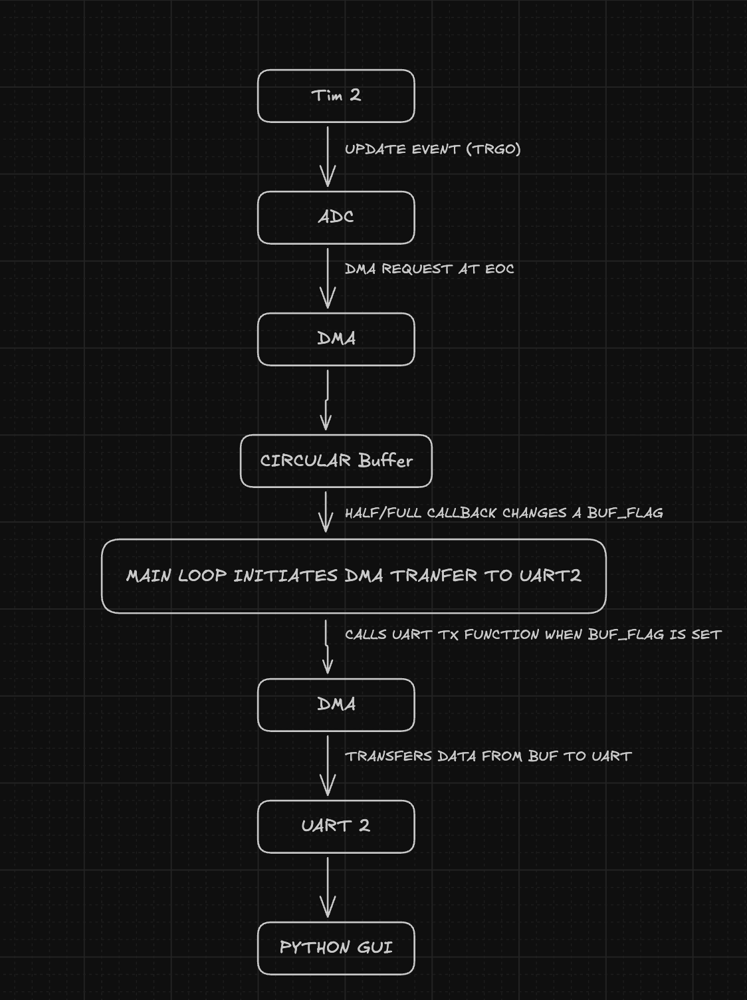
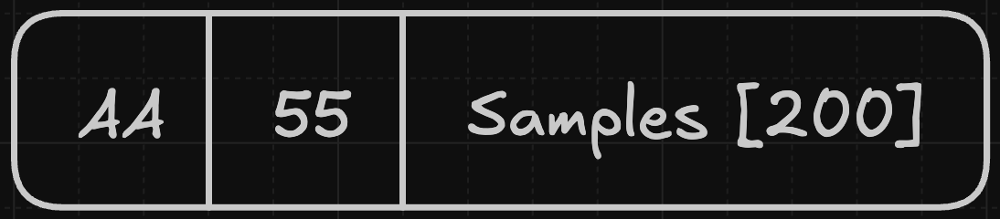
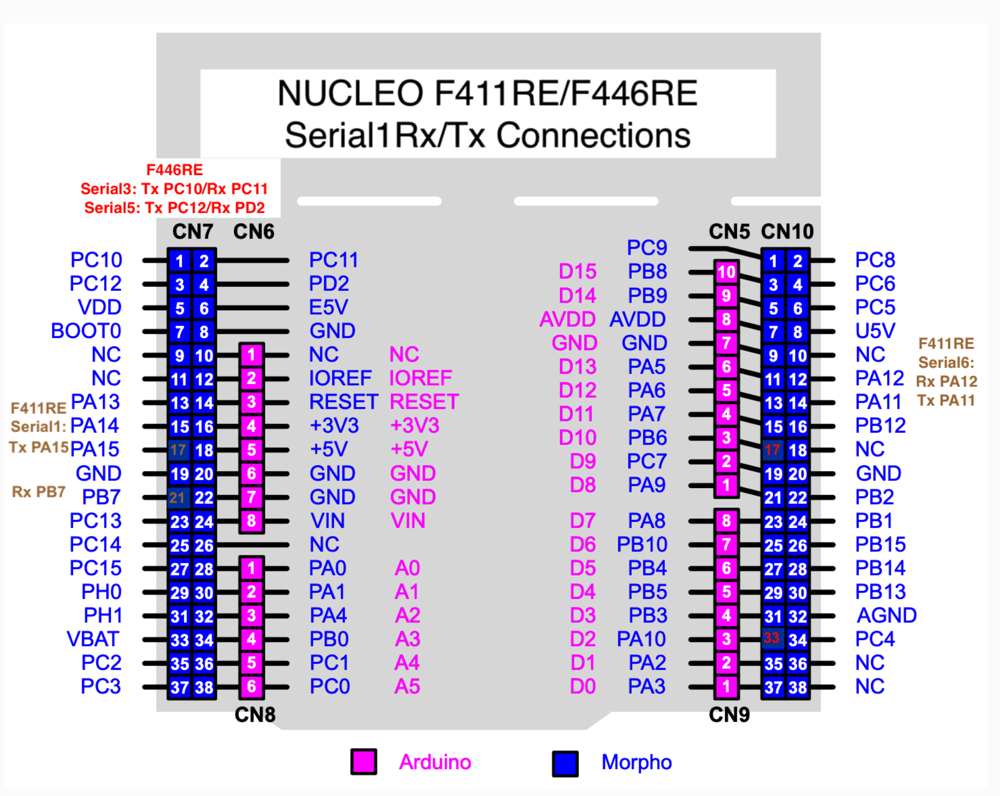
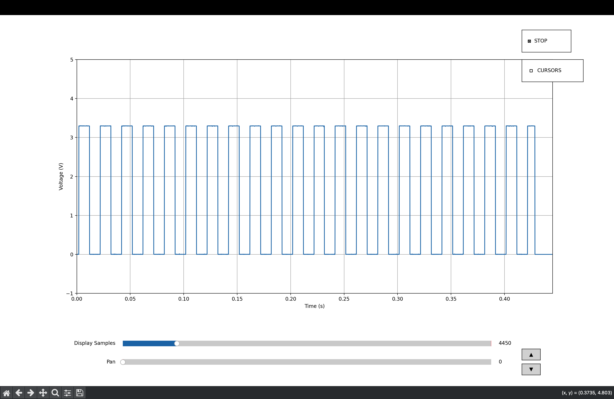
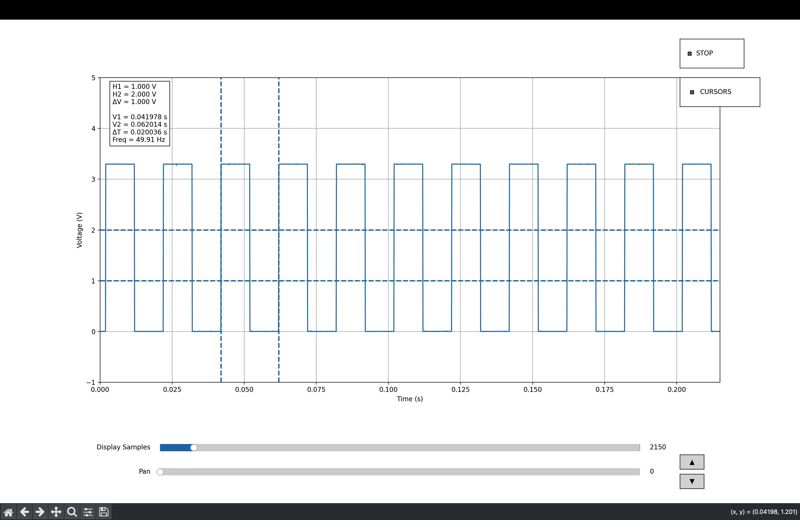
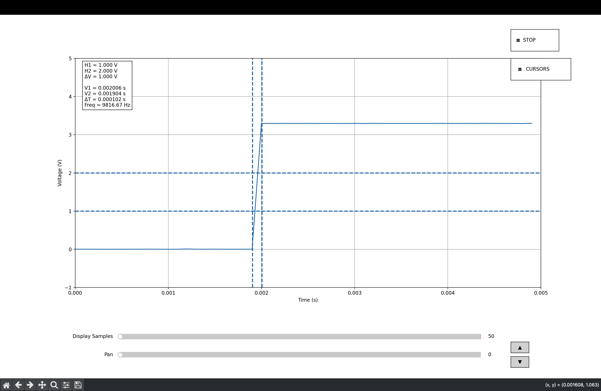

# STM32 Digital Oscilloscope

A real-time digital oscilloscope built using STM32F446RE, ADC DMA acquisition, UART DMA streaming, and a Python-based visualization interface.

## Demo

[!Demo_vid](Images/oscilloscope_demo.gif)

## Performance

- ADC Resolution: 12-bit
- Sampling Rate: 10 kSPS
- UART Baud Rate: 921600
- ADC Buffer Size: 400 Samples
- Packet Size: 402 Bytes
- Theoretical Bandwidth: 5 kHz

## Overview

This project samples analog signals using the STM32 ADC triggered by a hardware timer. Samples are collected using DMA and streamed to a PC over UART. A Python GUI receives the data, reconstructs packets, and displays the waveform in real time.

The project was built to gain hands-on experience with:

- STM32 peripherals
- ADC and DAC
- DMA
- Timers
- UART communication
- Real-time data acquisition
- Signal visualization using Python

## System Architecture



- If image not visible then kindly look into images folder

## Sampling Freq

## Sampling Configuration

- System Clock = 84 MHz

- Timer Prescaler (PSC) = 839

- Timer Clock = 100 kHz

- Auto Reload Register (ARR) = 9

- Sampling Frequency = 10 kHz

### Timer Clock Calculation

Timer clock is derived from the system clock using the prescaler:

f_timer = 84 MHz / (839 + 1) = 100 KHz

### Sampling Frequency Calculation

The timer generates an update event every `ARR + 1` counts:

f_sample = 100 KHz / (9 + 1) = 10 KHz

### Sampling Period

T_sample = 1 / 10 KHz = 100 µs

Therefore, the ADC performs one conversion every **100 µs**, resulting in a sampling rate of **10 kSamples/s**.

## Packetization

- ADC DMA buffer length: **400 samples**
- ADC sample size: **16 bits (2 bytes)**
- DMA operates in **circular mode**
- DMA callbacks occur at:
  - Half-transfer (200 samples)
  - Transfer-complete (200 samples)

### UART Transmission

- Samples transmitted per packet: **200 samples**
- Payload size: **200 × 2 = 400 bytes**
- Synchronization header: **2 bytes (0xAA, 0x55)**

### Packet Size

- ADC Buffer length = 400 (each of 2 Bytes)
- As callback is called when buffer is half_full and full
- Uart Tx sample length = 200 (each of 2 Bytes)
- Uart Tx sample size = 400
- header bytes (necessary for synchronization) = 2 bytes (AA & 55)
- Total Tx Packet size = 2 (header) + 400 (samples) = 402 bytes

### Packet Format



## Oscilloscope Bandwidth

### Sampling Frequency

The ADC is triggered by TIM2 at a sampling rate of:

Fs = 10 kSamples/s

### Note

- I Didn't have a freq generator so all tests have been performed using on board DAC for sine wave and tim3 for square wave generation

### Theoretical Bandwidth

According to the Nyquist criterion, the maximum frequency that can be reconstructed without aliasing is:

Bandwidth ≈ Fs / 2

Therefore:

Theoretical Bandwidth = 10 kHz / 2 = 5 kHz

### Practical Bandwidth

The usable bandwidth is lower than the theoretical limit due to several system constraints:

- UART transmission throughput (921600 baud)
- Python GUI rendering and refresh rate
- Packetization and buffering latency
- ADC input characteristics and analog front-end limitations

## Features

- Timer-triggered ADC sampling
- DMA-based data acquisition
- UART DMA streaming
- Square & Sin waveform generation for testing
- Packet synchronization using headers
- Real-time waveform display
- Trigger mode
- Freeze mode
- Horizontal and vertical measurement cursors
- Frequency measurement using cursors
- Pan and zoom controls

## Hardware

### requirements

- STM32F446RE
- USB UART connection
- Analog input source / STM32F446RE

### connections

#### external

For external signal acquisition:

- The **A0 (Analog Input)** pin on the STM32F446RE is used as the ADC input.
- Connect the signal source positive terminal to **A0**.
- Connect the signal source ground to **GND** on the STM32 board.

#### internal (testing)



For testing without external equipment, the firmware can generate test waveforms internally.

- **TIM3** is configured to generate a square wave.
- **DAC1** is configured to generate a sine wave.

#### Square Wave Test

Connect:

```text
D7  --->  A0
```

#### Sine Wave Test

Connect:

```text
A2  --->  A0
```

## Software

### Firmware

- STM32CubeIDE
- STM32CubeMX

### PC Application

- Python 3.13
- NumPy
- Matplotlib
- PySerial

## Project Structure

Firmware/

- STM32CubeIDE project
- ADC, DMA, UART, Timer, and DAC configuration

Python_GUI/

- Real-time oscilloscope GUI with Trigger, Cursor, Freeze mechanism

Images/

- Screenshots of GUI

## How It Works

1. Timer 2 triggers ADC conversions at a fixed sampling rate.
2. ADC samples are transferred into memory using DMA.
3. Data is packed and transmitted over UART using DMA.
4. Python receives packets through the serial port.
5. Packets are decoded and displayed as a waveform.
6. Triggering and cursor measurements are performed on the PC.

## Outputs


- Sine wave generated using DAC on F446RE



- Square wave generated using TIM3 on F446RE



- Square wave with cursors



- Rise time measurements using cursors

## Installation

Clone the repository:

```bash
git clone <repo-url>
cd STM32_Digital_Oscilloscope
```

Install Python dependencies:

```bash
pip install -r requirements.txt
```

Run the GUI:

```bash
python oscilloscope.py
```

## Challenges Faced

### Packet Synchronization

Serial data corruption occasionally caused waveform instability.
Packet headers were introduced for synchronization.

## Future Improvements

- Increasing STM - PC transmission speed
- FFT spectrum analyzer
- Multiple channels

## Limitation (ver 1)

- Low-frequency waveforms (<500 Hz) experience display distortion due to the current GUI sweep implementation.
- Very low-frequency signals (<200 Hz) require improvements to triggering and rendering logic.
- Input voltage range limited to 0–3.3 V.
- Sampling rate is fixed at compile time.
- Single-channel acquisition only.
